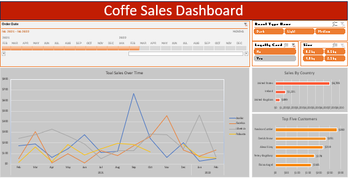

 # ☕ Coffee Sales Analysis Project

---

## 🌟 Table of Contents
1. [Project Overview](#project-overview)
2. [Dataset](#dataset)
3. [Research Questions](#research-questions)
4. [Data Cleaning & Preparation](#data-cleaning--preparation)
5. [Analysis & Visualizations](#analysis--visualizations)
6. [Insights & Conclusions](#insights--conclusions)
7. [Limitations & Future Work](#limitations--future-work)
8. [Project Files](#project-files)
9. [Author](#author)
10. [Fun Note](#fun-note)
---
## ❓ Research Questions: Coffee Sales Analysis

The analysis focused on answering the following key questions:

1. **Total Sales Over Time**  
   - How much revenue was generated during the given period?

2. **Sales by Country**  
   - Which countries contributed the most to coffee sales?

3. **Top 5 Customers**  
   - Who are the highest-spending customers?

**Filters Applied:**  
- Roast Type Name  
- Timeline / Order Date
---

**Filters Applied:**  
- Roast Type Name  
- Timeline / Order Date  
- Loyalty Card Status  
- Coffee Size  

**Analysis Tools:**  
PivotTables, Charts, and Excel formulas including `XLOOKUP` (to combine sheets), `IF` (to convert size codes M/L/D into Medium/Light/Dark), `SWITCH` (for easier mapping), and `LOWER` (to standardize text).
---
## 🧹 Data Cleaning & Preparation

Before performing analysis, the dataset was cleaned and structured using the following steps:

1. **Combining Sheets**  
   - Used `XLOOKUP` to merge multiple sheets into a single dataset for easier analysis.

2. **Standardizing Data**  
   - Converted size codes (`M`, `L`, `D`) to descriptive labels (`Medium`, `Large`, `Dark`) using `IF` functions.  
   - Learned and applied `SWITCH` for easier mapping of multiple conditions.  
   - Used `LOWER()` to standardize text for consistency in categorical columns.

3. **Filtering Data**  
   - Applied filters to focus analysis on:
     - Specific **Roast Type Name**  
     - **Timeline** (Order Date)  
     - **Loyalty Card Status**  
     - **Coffee Size**

4. **Validation**  
   - Checked for missing or inconsistent entries in key columns like `Sales`, `Customer Name`, and `Country`.  
   - Ensured numeric columns (`Sales`, `Quantity`) were correct and ready for aggregation.

**Tools Used:**  
Excel formulas (`XLOOKUP`, `IF`, `SWITCH`, `LOWER`), PivotTables, Charts.
---
## 📊 Analysis & Visualizations

The analysis focused on the research questions using PivotTables and charts. A **summary image** was created to show the key findings.

**Key Insights:**

- **Total Sales Over Time:** Revenue trends can be clearly observed across the period.  
- **Sales by Country:** Top-performing countries can be identified for targeted marketing.  
- **Top 5 Customers:** High-value customers are highlighted for loyalty programs or promotions.

**Business Implications:**

- Focus on **high-performing regions** to maximize sales.  
- Identify **top customers** for personalized marketing.  
- Track **sales trends over time** to optimize inventory and promotions.
---
## ⚠️ Limitations & Future Work

**Limitations:**

- Dataset is limited in size, which may affect overall representativeness.  
- No detailed timeline information for precise trend forecasting.  
- Some fields may have incomplete or inconsistent data.  

**Future Work:**

- Collect more sales data over a longer period to analyze trends more accurately.  
- Explore additional variables such as marketing campaigns or seasonal effects.  
- Use visualization tools like Power BI or Tableau for interactive dashboards.  
- Implement predictive analytics to forecast customer behavior and optimize strategies.
---
## 📂 Project Files

All relevant files are included in this repository:

- **Dataset xlsx:** [coffee_sales.xlsx](coffee.xlsx)  
- **Summary Screenshot:** [coffee_sales_summary.png](./screenshots/coffee_sales_summary.png)  
---
## 👤 Author

- Name: Lawal Mayowa  
- GitHub: [KNGBRYANT](https://github.com/KNGBRYANT?tab=repositories)  
- LinkedIn: [Lawal Mayowa](https://www.linkedin.com/in/lawal-mayowa-160bb930b/)
